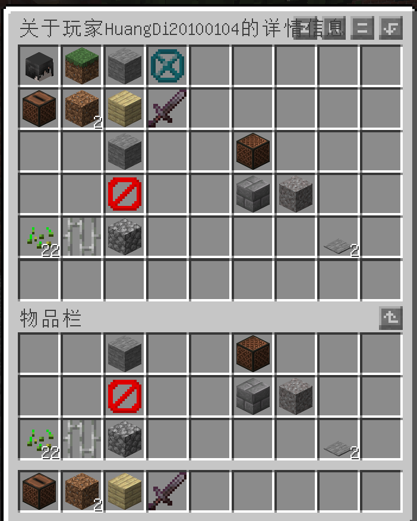
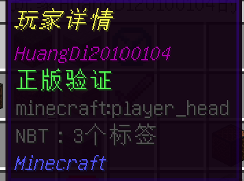

# dishaoplugin

# 介绍
dishao插件,轻量级的基于spigotapi1.16+的基础插件

# 安装教程

1.  将插件放在支持spigotapi服务端根目录下的/plugins文件夹中
2.  重启服务端
3.  将一张64x64像素的图片放在服务端根目录/plugins/dishao/中(不能是ico)

# 使用说明

1. 默认配置文件及解释:  
   \#开启后输出的文字(没有其他意义)  
   say: 在插件目录下的config.yml中的say:后面更改要输出的内容  
   \#是否开启dishao插件权限管理模块  
   permissions: true  
   \#给予非op玩家的权限  
   permissions-list:  
   \- dishao.help  
   \- dishao.tp  
   \- dishao.tell  
   \- dishao.out  
   \- dishao.zisha  
   \- bukkit.command.tps  
   \#非op玩家关闭的权限  
   off-permissions-list:  
   \- minecraft.command.seed
   \#插件启动时检测更新  
   detect-updates: true  
   \#服务器标题  
   server-motd:  
   \#服务器标题列表("%nl%"代表换行)  
   motd-list:  
   \- 第一行%nl%第二行  
   \#每个标题等待时间  
   motd-time: 3000L  
   \#加载标题输出  
   load-print: true  
   \#图标  
   motd-icon: favicon.png  
   \#超级用户  
   superuser: ''  
   \#名字范围  
   name-range: ^[A-Za-z\u4e00-\u9fa50-9_\-]+$  
2. 权限列表:
   dishao.tp: 传送命令的权限   
   dishao.tell:  私聊命令的权限  
   dishao.help:  帮助命令的权限  
   dishao.out:  退出服务器命令的权限  
   dishao.zisha:  自杀命令的权限  
   dishao.kick:  踢出玩家的权限  
   dishao.main_command.info:  查看详情的权限  
   dishao.main_command:  主命令的权限  
   dishao.main_command.config:  命令更改配置文件的权限  
   dishao.main_command.reload:  重载插件的权限
   dishao.playerinfo: 打开玩家详情gui的权限
3. 命令列表  
   /514:
   需要权限: "dishao.zisha"  
   命令名字:  
   \- "514"  
   命令详情: 自杀
   /help:  
   需要权限: "dishao.help"  
   命令名字:  
   \- "help"
   命令详情: 帮助  
   /tell:  
   需要权限: "dishao.tell"  
   命令名字:  
   \- "w"  
   \- "tell"  
   \- "msg"
   命令详情:私聊,/tell [玩家名字] [内容]  
   /out:  
   需要权限: "dishao.out"  
   命令名字:  
   \- "out"  
   命令
   命令详情:退出服务器
   /tp:  
   需要权限: "dishao.tp"  
   命令名字:
   \- "tp"  
   命令详情:传送,/tp [玩家名字]或/tp [x] [y] [z]   
   /kick:  
   需要权限: "dishao.kick"  
   命令名字:
   \- "kick"  
   命令详情:踢出玩家,/kick [玩家名字] [内容]  
   /playerinfo:  
   需要权限: "dishao.playerinfo"  
   命令名字:  
   \- "playerinfo"
   \- "pi"  
   命令详情: 打开玩家详情菜单,/playerinfo [玩家名字]  
   /playerinfolist:  
   需要权限: 超级用户  
   命令名字:  
   \- "playerinfolist"
   \- "pilist"  
   命令详情: 强制切断用户对另一用户的详情链接,/playerinfolist [详情链接]  
   /dishao:  
   需要权限: "dishao.main_command"  
   命令名字:  
   \- "dishao"  
   \- "ds"  
   命令详情: 主命令,若没有参数或只有一个参数"info"则输出插件详情(需要权限"dishao.main_command.info"),若第一个参数是"reload"则重载插件(需要权限"dishao.main_command.reload"),若第一个参数是"config"更改配置文件,若第二个参数是数组,第三个参数输入"add"或者"remove",然后输入值来修改,若第二个参数是布尔类型变量,则第三个参数输入"true"或"false"(改完后不会立刻重载,需要权限"dishao.main_command.reload",所有主命令只要有权限"dishao.main_command都可以执行")  
   /image:  
   需要权限:"dishao.image"
   命令名字:  
   \- "image"  
   \- "img"  
   命令详情: 将图片放在服务器根目录/plugin/dishao/image,输入/image [图片文件名],你就会获得一个印有选定图像的地图,128x128,如果不是正方形会进行拉伸.
# 详情界面详情
## GUI界面
当打开一个玩家的详情界面时,会产生一个Pinv对象。其中包含Opener(打开者),player(被打开者)  
当player的背包被更改,世界被更改,移动或传送时,将调用Pinv对象中的上传方法,背包,将盔甲,游戏模式,所在世界,和位置上传至详情界面
详情界面为一个6*9的物品栏,如下图:  
  
当鼠标放到钻石上时,会显示玩家的名字,如下图  
  
当鼠标放到第三个物品上时,会显示玩家的游戏模式,根据游戏模式,图标也会变化(和客户端使用f3+f4切换游戏模式时图标一样),如下图:  
  
  
  
  
当鼠标放在石头上时,会显示玩家所在的世界名称,如下图:  
  
当鼠标放在结构空位上时,会显示玩家的x,y,z坐标,点击可以传送至玩家,如下图:  
  
当player退出游戏或Opener关闭详情界面后,Pinv对象将被删除
## 详情链接
每个Pinv对象都会有一个详情链接,它的构造是这样的:[Opener的名字]->[player的名字]  
当超级用户使用/playerinfolist 强制关闭后,会删除对应的Pinv对象并且对Opener说:你对[player的名字]的查看被超级用户强制关闭!  

# 各个文件夹的作用
## PlayerData
顾名思义,存放了每个登陆过玩家的名字,uuid,最后一次登录ip,血量,游戏模式,是否为op
## ImageData
储存每个地图对应图片的文件,请尽量不要删除,否则后果不堪设想!
## image
储存需要在地图上出现的图片,如果你使用了文件夹内的文件,请不要再将它删除,否则服务端可能会不停的报错!
# 参与贡献

DicloudStudio

